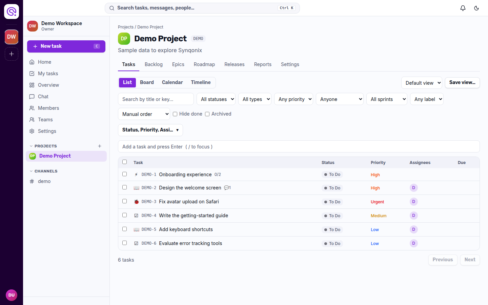
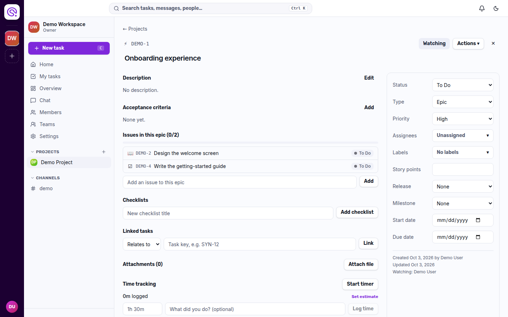
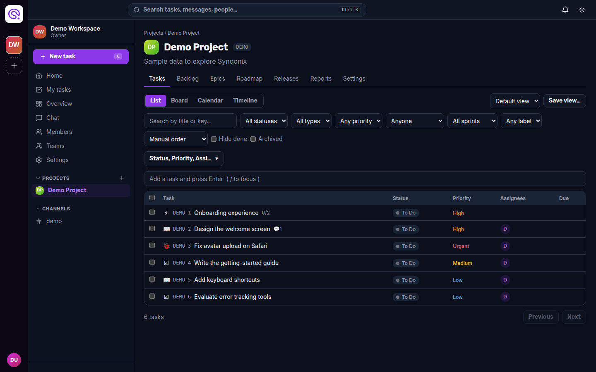

<div align="center">

<picture>
  <source media="(prefers-color-scheme: dark)" srcset=".github/assets/logo-dark.png">
  
</picture>

**Project management built for developers.**<br>
Plan sprints, track tasks, chat with your team, and start work from your editor.

[](https://github.com/abdullahqasim01/synqonix/actions/workflows/ci.yml)
[](LICENSE)
[](CONTRIBUTING.md)

</div>

<p align="center">
  
</p>

## Why Synqonix

Most project tools live in a browser tab, away from the code. Synqonix keeps tasks, sprints and team chat in one place and brings them into **VS Code**: pick a task, press *Start task*, and you are on a correctly named git branch with the task assigned to you and moved to *In Progress*.

It is self-hostable, runs on a small free-tier stack for a single team, and every part of it is open source under Apache 2.0.

## Features

- **Tasks** — epics, stories, tasks, bugs and sub-tasks with keys like `SYN-123`; markdown descriptions, acceptance criteria, checklists, labels, custom fields, attachments, comments with @mentions, time tracking, task templates and recurring tasks.
- **Views** — list, Kanban board (drag and drop), calendar and timeline; saved views and filters.
- **Agile** — backlog planning, sprints with burndown and velocity, estimates, releases, milestones and roadmap.
- **Chat** — channels, threads, reactions, direct messages and file sharing, live over WebSockets, with task links inside messages.
- **GitHub** — branches, commits, pull requests and CI status shown on tasks; merging can move the task; issue sync.
- **Notifications and search** — in-app inbox, email digests, muting; one search across tasks, comments, messages and people (only what you may see).
- **Reports and automation** — workspace and project reports, CSV/Jira/GitHub import and CSV export, outbound webhooks (HMAC-signed), automation rules, audit log.
- **Teams and permissions** — workspaces, teams, roles (Owner, Admin, Member, Viewer), private projects, personal API tokens.
- **VS Code extension** — task trees (mine, sprint, backlog, recent), task page, *Start task* with branch creation, status bar timer, commit-message prefill, notifications.

<details>
<summary>More screenshots</summary>

| Task | Dark mode |
|---|---|
|  |  |

</details>

## Try it with Docker (one command)

You only need **Docker**:

```bash
git clone https://github.com/abdullahqasim01/synqonix.git
cd synqonix
docker compose up --build
```

Then open **<http://localhost:3000>**, create an account, and read the verification email in the local inbox at <http://localhost:8025>. To start with a sample workspace, run `docker compose --profile demo up --build` and sign in as `demo@synqonix.local` / `demo-password-123`.

This starts Postgres, the API, the web app and Mailpit (a fake inbox), applies the database migrations automatically, and keeps your data in Docker volumes (`docker compose down -v` wipes it). It uses fixed development secrets over plain HTTP, so it is for trying Synqonix and for local use; for a real deployment see [Deploying](#deploying).

## Quick start (development)

To work on the code you run the apps yourself with hot reload. You need **Node.js 22**, **npm**, and **Docker** (for Postgres and a local mail inbox only).

```bash
git clone https://github.com/abdullahqasim01/synqonix.git
cd synqonix
docker compose -f docker-compose.dev.yml up -d   # Postgres 17.9 on :5432, Mailpit on :8025

# API  → http://localhost:4000  (Swagger UI at /docs)
cd api
cp .env.example .env
npm ci
npx prisma migrate deploy
npm run start:dev

# Web  → http://localhost:3000   (in a second terminal)
cd web
cp .env.example .env.local
npm ci
npm run dev
```

Optional demo data (a workspace, a Scrum project and an active sprint):

```bash
node api/scripts/seed-demo.mjs       # then sign in as demo@synqonix.local / demo-password-123
```

Verification and password-reset emails land in Mailpit at <http://localhost:8025>.

## The VS Code extension

```bash
cd vscode-extension
npm ci && npm run build
```

Open the folder in VS Code and press **F5**, then run **Synqonix: Sign in**. Details in [`vscode-extension/README.md`](vscode-extension/README.md).

## Repository layout

Three independent apps, each with its own `package.json` and lockfile (no root package, no workspaces):

| Folder | What it is | Stack |
|---|---|---|
| [`api/`](api) | REST + WebSocket API | NestJS, Prisma, PostgreSQL, Socket.IO, JWT, Resend/SMTP, S3-compatible storage |
| [`web/`](web) | Web app | Next.js (App Router), Tailwind, typed API client |
| [`vscode-extension/`](vscode-extension) | Editor integration | TypeScript, esbuild, typed API client |

The API publishes an OpenAPI document (`api/openapi.json`); `web` and `vscode-extension` generate their own typed clients from it (`npm run generate:api`). Nothing is imported across app folders.

## Deploying

- **Anywhere with Docker:** `docker-compose.prod.yml` (production settings and secrets) runs Postgres, the API and the web app. See [docs/deployment.md](docs/deployment.md) for configuration, upgrades, backups and observability.
- **Free tier for one team:** Vercel + Northflank + Neon + Resend + Filebase — step by step in [docs/deploy-free-tier.md](docs/deploy-free-tier.md).
- **Files** go to local disk in development or any S3-compatible bucket in production; uploads and downloads always use short-lived presigned links, so the bucket can stay private.

## Documentation

| | |
|---|---|
| [User guide](docs/user-guide.md) | First steps and daily use |
| [Deployment](docs/deployment.md) | Docker, environment reference, upgrades, backups |
| [Free-tier deployment](docs/deploy-free-tier.md) | Vercel, Northflank, Neon, Resend, Filebase |
| [GitHub integration](docs/github-integration.md) | Creating and configuring the GitHub App |
| [Test plan](docs/test-plan.md) | Running every automated suite and the manual checklist |

## Quality

- API: unit tests plus an end-to-end suite against a real Postgres (permissions matrix over every route, realtime, GitHub webhooks, storage, and more).
- Web: unit tests and Playwright browser tests (critical flows, CSP, accessibility scan with axe).
- Extension: unit tests, and end-to-end tests against the real API and a real git repository.
- Security: nonce-based Content-Security-Policy, rate limits, signed webhooks, SSRF-safe outbound webhooks, secret checks at boot, dependency audit and secret scanning in CI. See [SECURITY.md](SECURITY.md).

## Roadmap and known gaps

Synqonix is young. Things that are not done yet and good places to help:

- Live import of issues from the GitHub API (today: through the webhook or CSV), user-defined project templates.
- Per-workspace retention settings; more automation triggers (assignment, due dates, GitHub events); configurable dashboards.
- Planning poker.
- GitHub App installation should additionally verify the user with OAuth (see [SECURITY.md](SECURITY.md)).
- Realtime updates in the VS Code extension (it polls today); publishing it to the Marketplace.
- Running more than one API instance (needs a shared Socket.IO adapter).

## Contributing

Contributions are welcome — bug reports, ideas and pull requests. Read [CONTRIBUTING.md](CONTRIBUTING.md) first, and please follow the [Code of Conduct](CODE_OF_CONDUCT.md). Report security problems privately as described in [SECURITY.md](SECURITY.md).

## License

[Apache License 2.0](LICENSE). The Synqonix name and logo are not covered by the license grant (see [NOTICE](NOTICE)).
